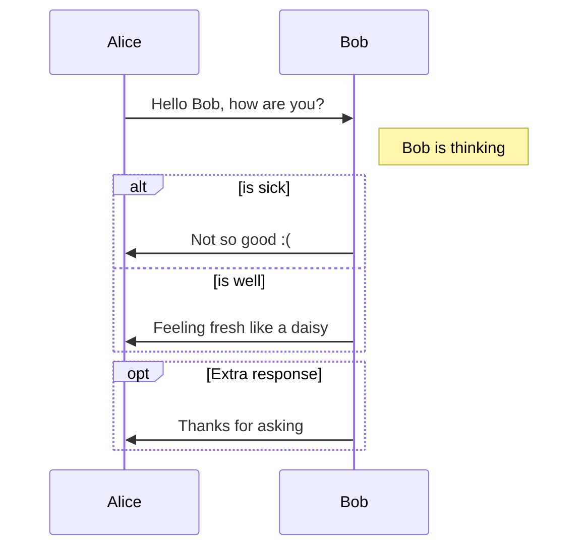

GitPress supports Markdown extension for diagrams, you could enable this feature using Markdown's code block syntax

The diagrams are powered by [Mermaid](https://knsv.github.io/mermaid/#mermaid), which supports sequence, flowchart and Gantt.

## Sequence diagram

see [doc here](https://mermaidjs.github.io/sequenceDiagram.html) 

## Flowchart

see [doc here](https://mermaidjs.github.io/flowchart.html) 

窶義``mermaid,autorun
  graph LR
    A[Hard edge] -->B(Round edge)
    B --> C{Decision}
    C -->|One| D[Result one]
    C -->|Two| E[Result two]
窶義``

## Gantt diagrams

see [doc here](https://mermaidjs.github.io/gantt.html) 

窶義``mermaid,autorun
  gantt
    title A Gantt Diagram
    dateFormat  YYYY-MM-DD
    section Section
    A task           :a1, 2014-01-01, 30d
    Another task     :after a1  , 20d
    section Another
    Task in sec      :2014-01-12  , 12d
    another task      : 24d
窶義``
